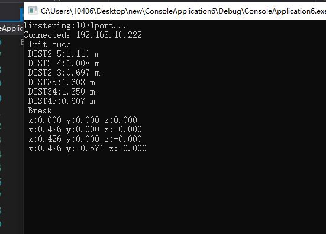

# 多小区坐标系建立
***
## 1
实现coordestablish（***int main_anchor_num,area_num***）
## 2
单小区的anchor应当确定，在
	
	if((mode == MODE_ANCHOR)&&((mode_num ==
	(main_anchor_ID+1))||(mode_num ==(main_anchor_ID+2))
	||(mode_num ==(main_anchor_ID+3)))) 	
	//   appinit.c文件中进行修改，现在先按4个算。

## 3
目前实现了各个小区的测距（**不在局限于A0为main anchor**），出现的问题是建立的坐标系存在问题，需要**进一步研究坐标系建立函数哪些部分需要进一步的修改**。测距结果可在实验数据

看出，测距结果正确，坐标系建立结果不正确。进一步的问题解决将在ver7中给出。
***
